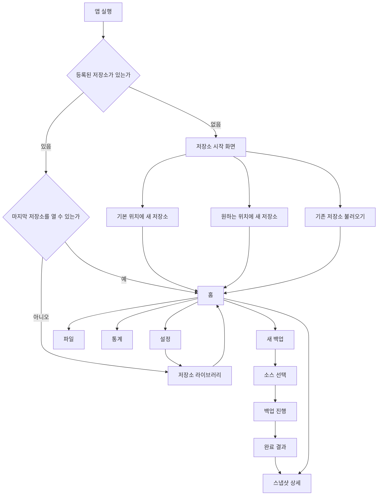

# 0012. UI 사용성 개선과 저장소 라이브러리

상태: 설계 확정, 구현 계획 작성 전 사용자 검토 대기

## 1. 배경

Chrona의 저장 엔진, 스냅샷, 복원, 비교, 압축, 탐색기, 파일 검사기, 통계, 무결성 검증은 구현되어 있다. 현재 UI는 이 기능을 `Repository`, `Sources`, `Snapshots`, `Explorer`, `Statistics`, `Integrity`, `Review` 장으로 그대로 노출한다.

이 구조는 내부 기능을 찾기에는 유리하지만 실제 사용자는 저장소 상태와 선행 조건을 이해한 뒤 여러 화면을 이동해야 한다. 모든 화면에 반복되는 상태 요약, 경로, `Waiting`, `Available`, `Ready`, `Loaded` 배지는 정보를 늘리지만 다음 행동을 명확하게 만들지 못한다.

Phase 9는 기능을 추가하는 단계가 아니라 기존 기능을 실제로 쓰기 쉬운 데스크톱 앱 구조로 재배치하는 단계다.

근거 화면과 측정 결과는 `docs/audits/ui-usability-2026-07/audit.md`에 기록되어 있다.

## 2. 목표

- 앱을 열면 마지막으로 사용한 저장소와 주요 작업을 바로 확인한다.
- 사용자는 내부 Repository/Source/Block 순서를 몰라도 백업을 만들 수 있다.
- 여러 저장소를 Steam 라이브러리처럼 앱에 등록하고 전환한다.
- 새 저장소는 기본 위치에 빠르게 만들 수 있고 필요하면 원하는 위치를 선택한다.
- 기존 저장소는 이동하거나 복사하지 않고 앱에 등록한다.
- 탐색기와 스냅샷처럼 정보가 많은 화면에 충분한 작업 공간을 제공한다.
- macOS와 Windows에서 같은 정보 구조와 동작을 제공한다.
- 현재의 녹색 중심 팔레트와 라이트/다크 모드를 유지한다.

## 3. 범위 제외

- 저장소 포맷, 블록 포맷, 압축 방식 변경
- 스냅샷 삭제와 미참조 블록 정리
- 자동 파일 감시와 자동 스냅샷
- 클라우드 저장소와 네트워크 동기화
- 실제 저장소 파일을 UI에서 바로 삭제하는 기능
- React Router 등 새로운 화면 전환 라이브러리 도입
- 백엔드 기능의 동작 의미 변경

## 4. 핵심 원칙

### 4.1 사용자 행동 기준

화면은 내부 모듈이 아니라 사용자가 하려는 일로 구분한다.

- 백업 만들기
- 저장된 파일 보기
- 스냅샷 보기와 복원
- 저장 효율 확인
- 저장소와 앱 설정 관리

### 4.2 상태는 필요할 때만

사이드바와 화면 제목에서 `Waiting`, `Available`, `Ready`, `Loaded` 배지를 제거한다.

상태는 다음 경우에만 표시한다.

- 작업 실행 중
- 저장소 경로 연결 끊김
- 무결성 주의 또는 실패
- 사용자가 실행한 작업의 성공 또는 실패

### 4.3 반복 정보 제거

저장소 이름과 경로는 상단 저장소 전환 영역에서 한 번만 표시한다. 모든 화면에 있던 네 칸 상태 요약과 두 칸 경로 영역은 제거한다.

### 4.4 작업 공간 우선

상단바와 사이드바는 고정하고 본문만 독립적으로 스크롤한다. 작업이 없을 때 하단 진행 바는 렌더링하지 않는다.

## 5. 전체 화면 구조

```text
┌──────────────────────────────────────────────────────────────┐
│ Chrona  [현재 저장소 ▾]              [새 백업] [☾] [설정] │
├──────────────┬───────────────────────────────────────────────┤
│ 홈           │ 화면 제목                         화면 동작 │
│ 파일         │                                               │
│ 스냅샷       │ 현재 화면의 실제 작업 내용                    │
│ 통계         │                                               │
│              │                                               │
│ 설정         │                                               │
├──────────────┴───────────────────────────────────────────────┤
│ 작업 중에만: 현재 파일 · 처리 용량 · 진행률 · 상태          │
└──────────────────────────────────────────────────────────────┘
```

### 5.1 상단바

상단바는 높이를 52~56px 범위로 제한한다.

왼쪽부터 다음 요소를 둔다.

1. 모바일 탐색 메뉴 버튼: 768px 미만에서만 표시
2. Chrona 제품명
3. 현재 저장소 전환 버튼
4. `새 백업` 주 동작 버튼
5. 라이트/다크 전환 버튼
6. 설정 버튼

현재 저장소 전환 버튼은 저장소 이름을 기본으로 보여주고 보조 문구로 경로를 표시한다. 클릭하면 등록된 저장소 목록, `새 저장소`, `기존 저장소 불러오기`를 제공한다.

저장소가 없을 때 `새 백업`은 비활성화하지 않고 저장소 생성 화면으로 연결한다. 사용자가 선행 조건을 직접 해결하도록 떠넘기지 않는다.

### 5.2 사이드바

기본 탐색은 다섯 항목으로 제한한다.

| 항목 | 역할 |
| --- | --- |
| 홈 | 현재 저장소 요약, 최근 작업, 백업 시작 |
| 파일 | 저장된 파일 탐색과 파일 상세 분석 |
| 스냅샷 | 스냅샷 목록, 비교, 복원 |
| 통계 | 저장 효율, 중복 제거, 압축, 블록 통계 |
| 설정 | 저장소 라이브러리, 압축, 무결성, 앱 설정 |

사이드바에는 일반 상태 배지를 두지 않는다. 저장소에 주의가 필요한 경우에만 설정 아이콘 옆에 작은 경고 표시를 둔다.

### 5.3 본문

본문 상단에는 현재 화면 제목, 한 줄 설명, 화면 전용 동작만 둔다. 공통 상태 카드와 경로 Dock은 제거한다.

본문은 화면별로 독립적인 레이아웃을 사용하되 다음 규칙을 공유한다.

- 외부 여백 24px, 좁은 화면 14~16px
- 섹션 간격 16px
- 카드 안에 다시 장식용 카드를 넣지 않음
- 데이터 표와 상세 영역은 가능한 높이를 채움
- 장 제목은 앱 작업 화면에 맞는 크기로 제한

### 5.4 하단 작업 표시

블록 저장, 스냅샷 생성, 복원, 통계 분석처럼 시간이 걸리는 작업이 있을 때만 하단에 표시한다.

표시 정보:

- 작업 이름
- 현재 파일명
- 처리된 용량 / 전체 용량
- 진행률
- 성공 또는 실패 결과로 연결되는 짧은 상태

작업이 끝나면 완료 상태를 잠시 보여준 뒤 닫고, 세부 결과는 toast 또는 해당 화면에서 확인한다. 유휴 상태의 `No active ingest`, `No file processing`은 표시하지 않는다.

## 6. 저장소 라이브러리

### 6.1 기본 저장 위치

실행 파일 또는 `.app` 번들 내부에는 저장하지 않는다. 운영체제가 제공하는 앱 전용 로컬 데이터 디렉터리 아래에 저장한다.

- macOS: `~/Library/Application Support/Chrona/Repositories/`
- Windows: `%LOCALAPPDATA%\Chrona\Repositories\`

구현에서는 문자열을 직접 조합하지 않고 Tauri의 플랫폼 경로 API로 앱 로컬 데이터 디렉터리를 구한다.

기본 생성 경로는 다음 형식이다.

```text
{appLocalDataDir}/Repositories/{repository-directory-name}
```

표시 이름과 실제 디렉터리 이름은 분리한다. 실제 디렉터리 이름은 경로에 안전한 이름과 충돌 방지 suffix를 사용한다.

### 6.2 저장소 생성 방식

`새 저장소` 화면은 다음 두 방식을 제공한다.

- 기본 위치에 만들기: 저장소 이름만 입력
- 위치 직접 선택: 저장소 이름과 부모 폴더 선택

고급 block size나 hash 설정은 노출하지 않는다. 압축은 기본 `standard`를 사용하고 생성 후 설정에서 변경한다.

### 6.3 기존 저장소 불러오기

기존 저장소 폴더를 선택하면 manifest를 검증한 뒤 앱 라이브러리에 등록한다.

- 저장소 파일을 복사하거나 이동하지 않음
- 이미 등록된 경로는 중복 등록하지 않음
- 지원하지 않는 schema는 명확한 오류 표시
- 외장 디스크가 분리된 경우 등록은 유지하고 `연결 끊김` 표시
- 다시 같은 경로를 찾으면 기존 등록을 복구

### 6.4 저장소 전환과 실행

- 마지막 활성 저장소 경로를 앱 설정에 기록한다.
- 다음 실행 시 해당 저장소를 자동으로 연다.
- 마지막 저장소를 열 수 없으면 저장소 라이브러리를 보여주고 다른 저장소 선택 또는 경로 다시 찾기를 제공한다.
- 등록된 저장소가 없으면 빈 홈 대신 저장소 시작 화면을 보여준다.

### 6.5 등록 해제와 삭제

Phase 9는 `목록에서 제거`만 제공한다. 이 동작은 Chrona 앱의 등록 정보만 제거하며 실제 저장소 폴더는 삭제하지 않는다.

실제 저장소 파일 삭제는 복구 불가능한 별도 기능이므로 이번 범위에서 제외한다.

## 7. 화면별 설계

### 7.1 저장소 시작 화면

등록된 저장소가 없을 때 표시한다.

주 동작:

1. `새 저장소 만들기`
2. `기존 저장소 불러오기`

새 저장소 만들기는 기본 위치를 사용한다. `위치 직접 선택`은 같은 화면의 보조 옵션으로 둔다.

### 7.2 홈

홈은 상세 분석 화면이 아니라 현재 저장소의 시작점이다.

표시 내용:

- 최신 스냅샷의 파일 수, 논리 용량, 고유 블록 수
- 마지막 백업 시각
- 최근 사용한 소스
- 최근 스냅샷
- 주 동작 `새 백업`

상세 파일 종류와 저장 효율은 통계 화면으로 이동한다. `Continue Working`, `Pinned`, `Recent repositories`를 각각 큰 패널로 반복하지 않고 최근 작업 목록 하나로 정리한다.

### 7.3 새 백업 흐름

`새 백업`은 화면 전환이 아니라 대화상자 또는 넓은 sheet로 연다.

1. 최근 소스 선택 또는 파일/폴더 선택
2. 스냅샷 이름 입력, 기본값은 현재 시각 기반 이름
3. 예상 작업 대상 확인
4. 백업 시작
5. 하단 작업 표시에서 진행 상태 확인
6. 완료 후 새 스냅샷 또는 저장 결과 열기

기존 `Sources`와 `Review` 장은 제거하고 이 흐름으로 통합한다.

### 7.4 파일

기존 Explorer와 File Inspector를 주 작업 화면으로 승격한다.

```text
┌─ 검색 · 종류 · 스냅샷 상태 · 원본 상태 ──────────────────┐
├──────────────────────────┬─────────────────────────────────┤
│ 파일 목록                │ 선택 파일 상세                  │
│ 독립 스크롤              │ 버전 / block map 독립 스크롤   │
└──────────────────────────┴─────────────────────────────────┘
```

- 요약 지표는 한 줄로 줄임
- 필터 영역은 목록 상단에 유지
- 목록과 상세는 각각 독립 스크롤
- 선택한 파일은 URL 대신 앱 상태로 유지
- 좁은 화면에서는 파일 선택 후 상세 화면으로 전환하고 뒤로 가기를 제공

### 7.5 스냅샷

기본 구조는 왼쪽 목록, 오른쪽 상세다.

- 상단 동작: `새 스냅샷`, `비교`
- 목록: 이름, 생성 시각, 파일 수, 논리 용량
- 상세: 요약, 변경 파일, 복원
- 복원은 대상 선택과 확인을 포함한 별도 대화상자로 분리
- 비교는 기준/대상 선택 후 같은 화면의 비교 보기로 전환

생성·상세·복원·비교를 한 세로 패널에 동시에 노출하지 않는다.

### 7.6 통계

현재 통계 화면의 정보 구조를 대부분 유지한다.

- 상단 공통 상태 영역 제거
- `분석 실행`을 화면 제목 옆 동작으로 이동
- 핵심 네 지표와 저장 절감, 물리 블록, 변화 추이 유지
- 분석 전에는 설명과 실행 버튼만 표시

### 7.7 설정

설정은 왼쪽 설정 목록과 오른쪽 상세로 구성한다.

| 구역 | 내용 |
| --- | --- |
| 저장소 | 등록된 저장소 목록, 생성, 불러오기, 등록 해제, 경로 다시 찾기 |
| 저장 방식 | 현재 저장소 압축 모드 변경 |
| 저장소 상태 | 무결성 검증 실행과 결과 |
| 화면 | 라이트/다크 모드 |

무결성 검증은 일반 탐색 장에서 제거하지만, 오류가 발견되면 홈과 설정에 명확한 경고와 이동 동작을 제공한다.

## 8. 화면 연결



## 9. 반응형 구조

### 데스크톱: 1024px 이상

- 상단바 고정
- 220~240px 사이드바 고정
- 본문 독립 스크롤
- 파일과 스냅샷은 master-detail 유지

### 태블릿: 768~1023px

- 사이드바를 아이콘 중심 축소 형태로 전환
- 상단 저장소 이름은 말줄임
- master-detail 비율을 조정하되 동시에 유지

### 모바일: 767px 이하

- 사이드바는 overlay drawer이며 기본 닫힘
- 앱 실행 시 본문이 첫 화면에 표시
- 상단바는 메뉴, 저장소 전환, 주요 동작만 유지
- master-detail은 목록과 상세를 별도 화면 상태로 전환
- 하단 작업 표시는 두 줄 이하의 compact overlay 사용

## 10. 컴포넌트 구조

현재 `RepositoryPage.tsx`와 `RepositoryPage.css`의 책임을 다음 경계로 분리한다.

```text
src/
  app/
    AppShell.tsx
    AppTopBar.tsx
    AppSidebar.tsx
    OperationBar.tsx
    app-shell.css
  features/
    home/
      HomePage.tsx
    backup/
      NewBackupDialog.tsx
    repository-library/
      RepositoryLibraryMenu.tsx
      RepositorySetupDialog.tsx
      RepositorySettings.tsx
      repositoryRegistry.ts
    explorer/
      ExplorerPage.tsx
      FileInspectorPanel.tsx
    snapshots/
      SnapshotsPage.tsx
      SnapshotComparePanel.tsx
      RestoreSnapshotDialog.tsx
    statistics/
      StatisticsPage.tsx
      StatisticsDashboard.tsx
    settings/
      SettingsPage.tsx
      IntegritySettings.tsx
  shared/
    api/
      chronaApi.ts
    types/
      chrona.ts
```

기존 `RepositoryPage`는 한 번에 삭제하지 않는다. 상태와 API 동작을 페이지 컴포넌트로 옮긴 뒤 최종적으로 앱 수준 controller를 `AppShell`로 교체한다.

화면 전환은 현재와 같은 React state union을 사용한다.

```ts
type AppView = 'home' | 'files' | 'snapshots' | 'statistics' | 'settings';
```

새 라우팅 의존성은 추가하지 않는다.

## 11. 앱 저장소 등록 데이터

저장소 내부 metadata와 별도로 앱 수준 등록 목록이 필요하다.

```rust
pub struct RegisteredRepository {
    pub repository_id: String,
    pub display_name: String,
    pub path: PathBuf,
    pub added_at: String,
    pub last_opened_at: String,
}

pub struct RepositoryRegistry {
    pub schema_version: u32,
    pub active_repository_id: Option<String>,
    pub repositories: Vec<RegisteredRepository>,
}
```

등록 목록은 운영체제 앱 설정 디렉터리에 저장하고 `.tmp` 작성 후 이름 변경 방식으로 갱신한다. 저장소 자체의 `indexes/`에는 저장하지 않는다. 한 저장소가 다른 저장소 목록을 소유하지 않도록 하기 위함이다.

내부 metadata 경로 규칙과 달리 등록 목록의 path는 로컬 운영체제 절대 경로다. 다른 운영체제로 복사되는 데이터가 아니므로 `/` 정규화를 적용하지 않는다.

## 12. 오류 처리

- 기본 위치 생성 실패: 원인 표시 후 위치 직접 선택 제공
- 기존 저장소 검증 실패: 등록하지 않고 manifest 문제 표시
- 등록 경로 중복: 기존 등록 항목으로 이동
- 외장 저장소 연결 끊김: 등록 유지, 경로 다시 찾기 제공
- 마지막 저장소 자동 열기 실패: 다른 저장소 사용을 막지 않음
- 백업 실패: 하단 작업 표시를 오류 상태로 바꾸고 해당 화면에서 세부 메시지 확인
- 통계와 무결성 실패: 다른 화면과 저장소 전환은 계속 사용 가능

## 13. 테스트 기준

### 단위 테스트

- 저장소 등록, 중복 방지, 활성 저장소 변경, 등록 해제
- 기본 저장소 디렉터리 이름 안전 변환과 충돌 처리
- 연결이 끊긴 저장소 상태 판정
- 진행 작업이 없을 때 `OperationBar` 미표시
- 일반 사이드바 항목에 상태 배지가 없음

### UI 테스트

- 저장소가 없으면 시작 화면 표시
- 기본 위치 생성과 위치 직접 선택 흐름
- 기존 저장소 불러오기와 저장소 전환
- 마지막 저장소 자동 열기
- `새 백업`에서 소스 선택부터 완료 결과까지 연결
- 파일 목록과 상세 선택 유지
- 스냅샷 목록, 복원 대화상자, 비교 화면 전환
- 무결성 경고에서 설정 화면 이동
- 작업 중에만 하단 진행 표시

### 화면 검증

- 1440×960 라이트/다크
- 1024×768 라이트/다크
- 390×844 라이트/다크
- 모바일 첫 화면에서 본문 제목과 주요 동작이 보이는지 확인
- 200% 확대에서 주요 동작과 텍스트가 겹치지 않는지 확인
- 키보드만으로 상단바, 사이드바, 대화상자, 목록, 상세에 접근 가능한지 확인

## 14. 완료 기준

- `Waiting`, `Available`, `Ready`, `Loaded` 탐색 배지가 제거된다.
- 앱 실행 시 마지막 활성 저장소가 자동으로 열린다.
- 저장소가 없으면 기본 생성, 사용자 위치 생성, 기존 저장소 불러오기를 선택할 수 있다.
- macOS와 Windows에서 플랫폼 앱 데이터 경로를 기본 저장 위치로 사용한다.
- 등록된 저장소를 상단바에서 전환할 수 있다.
- Home, Files, Snapshots, Statistics, Settings 다섯 화면으로 탐색이 단순화된다.
- Sources와 Review 장이 새 백업 흐름으로 통합된다.
- 상단 공통 상태 카드와 경로 Dock이 제거된다.
- 진행 표시는 실제 작업 중에만 하단에 나타난다.
- 모바일에서 사이드바보다 본문이 먼저 보인다.
- 기존 저장, 스냅샷, 비교, 복원, 탐색, 파일 검사, 통계, 무결성 기능의 테스트가 유지된다.

## 15. 구현 순서 방향

세부 Task는 별도 Phase 9 구현 계획에서 작성한다. 큰 순서는 다음을 유지한다.

1. 저장소 등록 데이터와 기본 경로
2. 앱 셸, 상단바, 사이드바, 반응형 스크롤 구조
3. 저장소 시작·전환·생성·불러오기
4. 홈과 새 백업 흐름
5. 파일·스냅샷·통계·설정 화면 이관
6. 진행 표시와 오류 피드백
7. 전체 회귀 및 화면 검증
